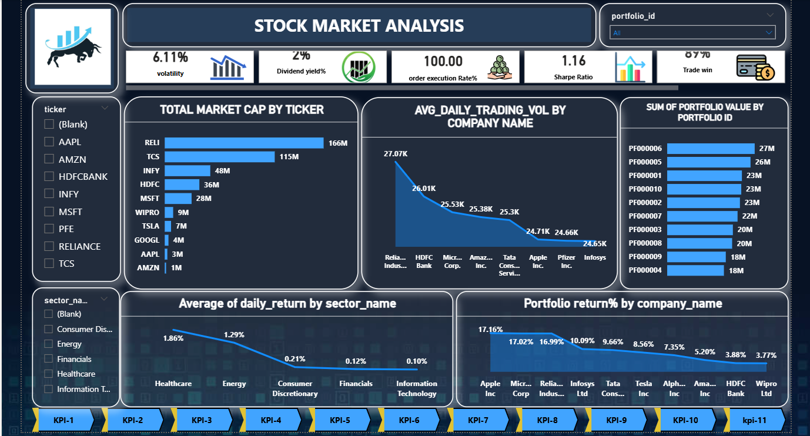
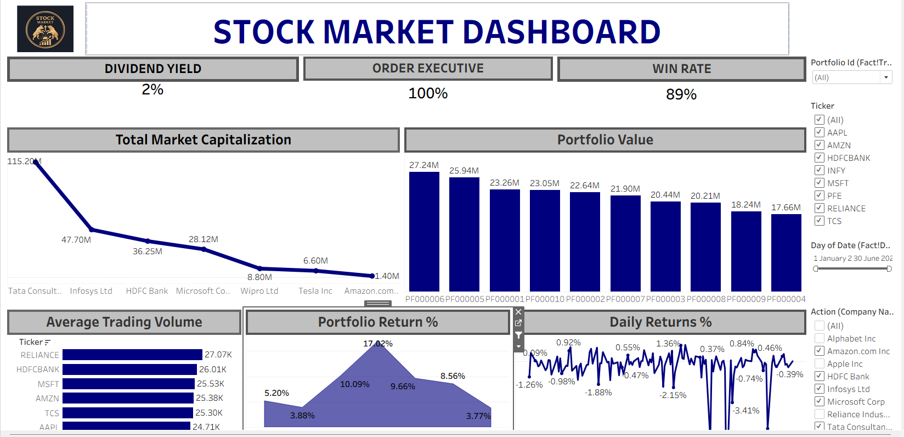

📊 Stock Market Analysis Dashboard
📌 Overview

This project analyzes stock market and portfolio performance using financial data. The objective was to evaluate company performance, sector trends, portfolio returns, and risk metrics through an interactive dashboard.

The dashboard helps in understanding:

Market capitalization by company

Average daily trading volume

Portfolio return percentage

Sector-wise average returns

Risk indicators like volatility and Sharpe ratio

🎯 Problem Statement

Investors need a clear view of stock performance, portfolio returns, and risk exposure to make informed investment decisions.

This project aims to transform raw stock market data into meaningful insights through structured analysis and visualization.

🛠 Tools & Technologies

Excel – Data cleaning and preprocessing

SQL – Data querying, aggregations, filtering

Power BI – Data modeling and interactive dashboard creation

Tableau – Visualization and comparative analysis

📊 Key Performance Indicators (KPIs)

Volatility: 6.11%

Dividend Yield: 2%

Order Execution Rate: 100%

Sharpe Ratio: 1.16

Trade Win Rate: 87%

These KPIs help evaluate both performance and risk-adjusted returns.

📈 Key Insights

Reliance Industries has the highest market capitalization in the dataset.

Healthcare sector shows the highest average daily return.

Apple and Microsoft contribute the highest portfolio returns.

Majority of portfolios are well distributed, with PF00006 having the highest value.

High trading volumes indicate strong liquidity in major stocks.

💡 Recommendations

Allocate more investment toward consistently high-performing sectors.

Use Sharpe Ratio along with volatility to assess risk-adjusted returns.

Diversify portfolios across sectors to reduce overall risk exposure.

Monitor trading volumes before making short-term investment decisions.

🧠 Skills Demonstrated

Data Cleaning & Transformation

SQL Aggregations & Filtering

Financial KPI Calculation

Dashboard Design & Data Visualization

Business Insight Generation

📷 Power BI Dashboard Preview

## 📊 Tableau Dashboard Preview

⭐ This project demonstrates my ability to analyze financial datasets and convert them into actionable business insights through interactive dashboards.
